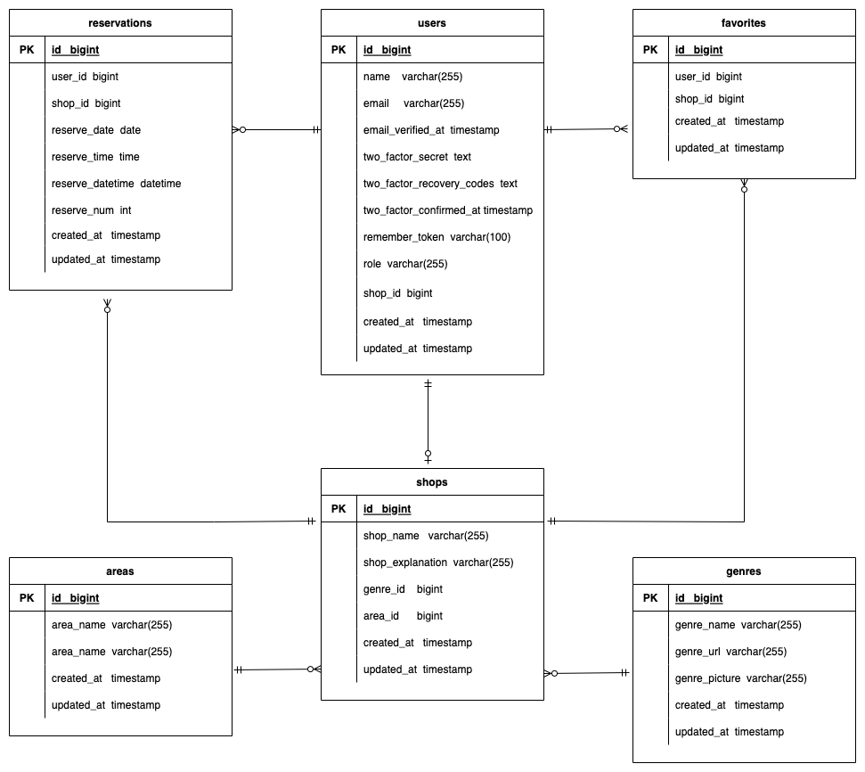

# restaurant-rsv1


##README 2024/09/28 修正

## アプリケーション名

飲食店予約管理システム


## 作成した目的

飲食店の情報HPを構築し、お店情報を掲載。ユーザが予約、お気に入り登録できるようにする

## アプリケーション URL

- 店舗一覧ページ http://localhost/

## レポジトリー
https://github.com/takatsutsu/restaurant-rsv1.git

## 他のレポジトリー

## 機能一覧

- 会員情報登録
- ログイン
- ログアウト
- ユーザー情報取得
- ユーザー飲食店お気に入り一覧取得
- ユーザー飲食店予約情報取得
- 飲食店一覧取得
- 飲食店詳細取得
- 飲食店お気に入り追加
- 飲食店お気に入り削除
- 飲食店予約情報追加
- 飲食店予約情
- エリアで検索する
- ジャンルで検索する
- 店名で検索する

##  追加実装項目　　※詳細は後述
- 予約変更機能
- バリデーション
- レスポンシブデザイン
- 管理画面
- ストレージ
- 認証
- メール送信
- リマインダー
- QRコード
- 環境の切り分け

##  　追加機能（未実施項目）
- 評価機能
- 決済機能
- AWS


## 使用技術(実行環境)

- PHP 7.4.9
- Laravel Framework 8.83.8
- MySQL 8.0.26
- phpmyadmin 5.2.1

## テーブル設計


## ER 図




## 環境構築

**Docker ビルド**

●$ `cd coachtech/laravel`

●$ `git clone git@github.com:coachtech-material/laravel-docker-template.git`

●$ `mv laravel-docker-template [restaurant-rsv1]`  
※[attendannce1]は任意のフォルダ名


●開発の履歴を残すために、個人個人のリモートリポジトリの url を変更します。
●[attendannce1]名のリポジトリ―を GITHUB にて作成

●ターミナルより以下コマンドで　ローカルリポジトリのデータをリモートリポジトリに反映  
　　$ `git add .`

　　$ `git commit -m "リモートリポジトリの変更"`

　　$ `git push origin main`


●$ `cd [restaurant-rsv1]
●$ `docker-compose up -d --build`
●$ `code .`

●DockerDesktop アプリを立ち上げる
　コンテナに[restaurant-rsv1]が存在し、稼働していればOK

**LARAVEL 環境構築**

●$ `docker-compose exec php bash`

●$ `composer install`
●  $ `exit`

● .env (.env.test   .env.prod )に以下の環境変数を追加

```
DB_CONNECTION=mysql
DB_HOST=mysql
DB_PORT=3306
DB_DATABASE=laravel_db
DB_USERNAME=laravel_user
DB_PASSWORD=laravel_pass
```


● アプリケーションキーの作成  
$ `docker-compose exec php bash`

$ `php artisan key:generate`

● マイグレーションの実行  
$ `docker-compose exec php bash`

$ `php artisan migrate`

● シーディングの実行 
$ `docker-compose exec php bash`


$ `php artisan db:seed`

シーダーで作成するデータ
   １.users
     管理者          admin@gmail.com
     店舗管理者会員   19ユーザを登録
                    shop0001@gmail.comから  shop0019@gmail.com
     一般会員        17ユーザを登録
                   ログインID（メールアドレス）
                   aa@gmail.com
                   bb@gmail.com
                   cc@gmail.com
                       ・
                       ・
                       ・


      ログイン初期パスワードは全て password

    2.shops
     店舗管理者会員　と連動連動して19店舗を登録

    ３.areas
      全国都道府県を登録
    4.genres
      1 イタリアン
      2 ラーメン
      3 居酒屋
      4 寿司
      5 焼肉


** 追加実装項目　**


- ①予約変更機能
    メニュー　各一般ユーザーのマイページの予約一覧より、予約修正を押下
- ②バリデーション

- ③レスポンシブデザイン
- ④管理画面
    管理者アカウントについては、admin@gmail.comにてシーダーで登録される。（初期パスワード  password）
    店舗管理者については、管理者でログイン後、メニューの「ShopManager-Registration」を押下し、店舗管理者登録ページから登録を行う。
    ※店舗管理者は、管理者権限でないと登録できない
     店舗管理者会員については、登録後、一般会員と同様、メールにより認証される。
     店舗管理者は、アカウントが登録され、メール認証が行われたら、ログインし店舗情報の登録を実施。
     店舗管理者で、ログイン後、左上のメニュー「ShopContents-New」から店舗情報を新規登録。
     また、店舗管理者は、すでに登録してある店舗情報を更新することができる。
     店舗管理者で、ログイン後、左上のメニュー「ShopContents-Edit」から店舗情報を編集更新ができる。

- ⑤ストレージ
- ⑥認証
     一般会員。店舗管理者会員についてはアカウントを登録すると、メール認証が送信され、メール
     で認証することによって、使用することができるようになる。
     認証メールはMAILHOGにて確認可能。
     http://localhost:8025

- ⑦メール送信
     店舗管理者権限でログイン後、左上のメニューより「Notice-Email」を選択。
     お気に入り登録している会員に対して、同報される。

- ⑧リマインダー
    手動の場合
     phpコンテナに入る。
     $ docker-compose exec php bash;
     $ php artisan send:reservation-reminders
    自動の場合
     $ docker-compose exec php bash -c "php artisan send:reservation-reminders"
     上記のコマンドを各サーバのスケジューラ（クーロン）に登録し自動実行

- ⑨QRコード
- ⑩環境の切り分け
   .env ファイルについては以下の内容を直接.envに記載するのではなく
    予め、以下のファイルを作成。

    テスト環境用  .env.testを作成   $ cp .env.example .env.test
    本番環境用    .env.prodを作成   $ cp .env.example .env.prod

  例：テスト環境であれば、.env.testに以下の環境変数を記載
    本番環境用であれば、.env.prodに以下の環境変数を記載
```
DB_CONNECTION=mysql
DB_HOST=mysql
DB_PORT=3306
DB_DATABASE=laravel_db
DB_USERNAME=laravel_user
DB_PASSWORD=laravel_pass
```

    環境の切り替えは、各ファイルを.envに置き換える
    テスト環境の場合は
    $ cp .env.test .env

    本番環境の場合は
    $ cp .env.prod .env


