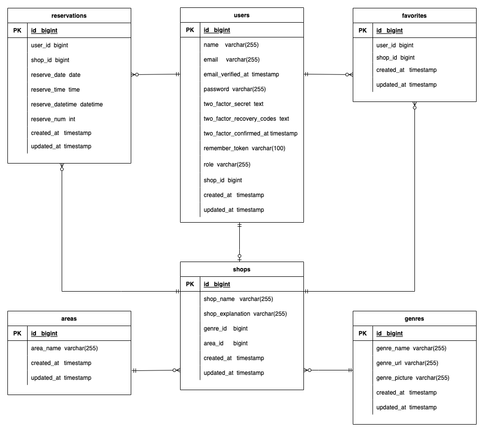

# restaurant-rsv1

##README 2024/09/28 修正

## アプリケーション名

飲食店予約管理システム


## 作成した目的

飲食店の情報 HP を構築し、お店情報を掲載。ユーザが予約、お気に入り登録できるようにする

## アプリケーション URL

- 店舗一覧ページ http://localhost/
- phpMyAdmin-url http://localhost:8080
- MailHog-url http://localhost:8025

## レポジトリー

https://github.com/takatsutsu/restaurant-rsv1.git

## 他のレポジトリー

## 機能一覧

- 会員情報登録
- ログイン
- ログアウト
- ユーザー情報取得
- ユーザー飲食店お気に入り一覧取得
- ユーザー飲食店予約情報取得
- 飲食店一覧取得
- 飲食店詳細取得
- 飲食店お気に入り追加
- 飲食店お気に入り削除
- 飲食店予約情報追加
- 飲食店予約情
- エリアで検索する
- ジャンルで検索する
- 店名で検索する

## 追加実装項目　　※詳細は後述

- 予約変更機能
- バリデーション
- レスポンシブデザイン
- 管理画面
- ストレージ
- 認証
- メール送信
- リマインダー
- QR コード
- 環境の切り分け

## 　追加機能（未実施項目）

- 評価機能
- 決済機能
- AWS

## 使用技術(実行環境)

- PHP 7.4.9
- Laravel Framework 8.83.8
- MySQL 8.0.26
- phpmyadmin 5.2.1

## テーブル設計


## ER 図



## 環境構築

**GITHUB からのプロジェクトフォルダ取得**

- `$ cd coachtech/laravel`
- `$ git clone https://github.com/takatsutsu/restaurant-rsv1.git [restaurant-rsv1]`  
  ※[restaurant-rsv1]は任意のフォルダ

**開発の履歴を残すために、個人個人のリモートリポジトリの url を変更。**

- [restaurant-rsv1]名のリポジトリ―を GITHUB にて作成

★ ターミナルより以下コマンドでローカルリポジトリのデータをリモートリポジトリに反映

- `$ git add .`
- `$ git commit -m "リモートリポジトリの変更"`
- `$ git push origin main`

**DOCKER をビルドする**

- `$ cd restaurant-rsv1`
- `$ docker-compose up -d --build`
- `$ code .`
- DockerDesktop アプリを立ち上げる.  
  　コンテナに[restaurant-rsv1]が存在し、稼働していれば OK

**LARAVEL 環境構築**

- `$ docker-compose exec php bash`
- `$ composer install`
- `$ exit`

- .env (.env.test .env.prod )に以下の環境変数を追加

```
DB_CONNECTION=mysql
DB_HOST=mysql
DB_PORT=3306
DB_DATABASE=laravel_db
DB_USERNAME=laravel_user
DB_PASSWORD=laravel_pass
```

★ アプリケーションキーの作成

- `$ docker-compose exec php bash`
- `$ php artisan key:generate`

★ マイグレーションの実行

- `$ docker-compose exec php bash`
- `$ php artisan migrate`

★ シーディングの実行

- `$ docker-compose exec php bash`※
- `$ php artisan migrate:fresh`※
- `$ php artisan db:seed`※  
   ※ シーディングをやり直す場合は※を順番に行う

  シーダーで作成するデータ  
   １.users  
   ① 管理者 admin@gmail.com  
   ② 店舗管理者会員 20 ユーザを登録  
  　　　　　　shop0001@gmail.comから  
  　　　　　　shop0002@gmail.com  
  　　　　　　　　　　・  
  　　　　　　　　　　・  
  　　　　　　　　　　・  
  　　　　　　shop0020@gmail.com  
   ③ 一般会員 17 ユーザを登録  
  　　　　　　aa@gmail.com  
  　　　　　　bb@gmail.com  
  　　　　　　cc@gmail.com  
  　　　　　　　　　　・  
  　　　　　　　　　　・  
  　　　　　　　　　　・  
  　　　　　　qq@gmail.com  
  　　　※ログイン初期パスワードは全て password  
   2.shops  
  　　店舗管理者会員と連動連動して 20 店舗を登録  
   3.areas  
   全国都道府県を登録  
  4.genres  
  　　 1 イタリアン  
  　　 2 ラーメン  
  　　 3 居酒屋  
  　　 4 寿司  
  　　 5 焼肉

★ レストラン画像を移動

- プロジェクトフォルダ[restaurant-rsv1]直下の以下の画像ファイルを
  　　[restaurant-rsv1]/src/storage/app/public/にコピーする。  
   ①italian.jpg  
   ②ramen.jpg  
   ③izakaya.jpg  
   ④sushi.jpg  
   ⑤yakiniku.jpg

**追加実装項目(補足）**

- 予約変更機能  
   各一般ユーザーでログインし、左上のメニューからマイページ  
   の予約一覧より、予約修正を押下。
- バリデーション  
   会員登録ページ  
   ログインページ  
   飲食店詳細ページ（予約登録）  
   予約修正ページ  
   お知らせメール送信ページ  
   店舗管理者会員登録ページ  
   店舗管理者用店舗情報修正ページ  
   店舗管理者用店舗情報登録ページ

- レスポンシブデザイン  
   タブレット・スマートフォンでも表示が崩れないよう調整  
   ブレイクポイントは 768px

- 管理画面

  - 管理者アカウントについては、admin@gmail.comにてシーダーで登録される。（初期パスワード password）
  - 店舗管理者については、管理者でログイン後、メニューの「ShopManager-Registration」を押下し
    店舗管理者登録ページから登録を行う。
  - 店舗管理者は、管理者権限でないと登録できない。
  - 店舗管理者会員については、登録後、一般会員と同様、メールにより認証される。
  - 店舗管理者は、アカウントが登録され、メール認証が行われたら、ログインし店舗情報登録を実施。
  - 店舗管理者で、ログイン後、左上のメニュー「ShopContents-New」から店舗情報を新規登録。
  - また、店舗管理者は、すでに登録してある店舗情報を更新することができる。
  - 店舗管理者で、ログイン後、左上のメニュー「ShopContents-Edit」から店舗情報を編集更新ができる。

- ストレージ

  - 保存場所:①[restaurant-rsv1]/src/storage/app/public/
  - 表示用:②[restaurant-rsv1]/src/public

    ※② から ① にシンボリックを張っている

- 認証  
   一般会員。店舗管理者会員についてはアカウントを登録すると、メール認証が送信され、メールで認証することによって、使用することができるようになる。  
   認証メールは MAILHOG にて確認可能。
  http://localhost:8025

- メール送信  
   店舗管理者権限でログイン後、左上のメニューより「Notice-Email」を選択。
  お気に入り登録している会員に対して、同報される。

- リマインダー  
  ★ 手動の場合

  - `$ docker-compose exec php bash;`
  - `$ php artisan send:reservation-reminders`

  ★ 自動の場合

  - `$ docker-compose exec php bash -c "php artisan send:reservation-reminders"`  
    上記のコマンドを各サーバのスケジューラ（クーロン）に登録し自動実行

- QR コード  
   予約者は、自分のマイページより、対象店舗の予約情報から QR 表示を押下する。  
   店舗側は、QR コードを読み取ると予約画面が表示され照合できる。ただし、事前に店舗側はログインしておく必要がある。  
   QR コードに埋め込められた url は  
   http://reserve_match/{id}
- 環境の切り分け  
  ★ テスト環境

  - テスト環境 環境変数を記載  
    .env.test の内容を修正  
    以下、修正箇所。

    ```
    DB_CONNECTION=mysql
    DB_HOST=mysql
    DB_PORT=3306
    DB_DATABASE=laravel_db
    DB_USERNAME=laravel_user
    DB_PASSWORD=laravel_pass
    ```

    .env.test 修正後、.env.test から .env に上書きコピー  
     `$ cp .env.test .env`

  ★ 本番環境

  - 本番環境 .env.prod に以下の環境変数を記載。

  - 本番環境の場合、.env.prod から .env にコピー  
     `$ cp .env.prod .env`  
     コピー後、以下の項目は環境によって異なるため、直接.env ファイルを各自で設定。  
     以下の設定項目を修正。
    また機密情報のため GITHUB にあげるときは、以下項目は記載しないよう留意する。
    ```
     APP_KEY=
     APP_DEBUG=false
     APP_URL=
     DB_HOST=
     DB_USERNAME=
     DB_PASSWORD=""
     AWS_ACCESS_KEY_ID=
     AWS_SECRET_ACCESS_KEY=
     AWS_DEFAULT_REGION=
     AWS_BUCKET=
     AWS_USE_PATH_STYLE_ENDPOINT=false
    ```

**ログイン権限による左上メニューの違い**

- ログインしていない場合  
   ①Home  
   ②Registration 　　(一般会員登録ページ)  
   ③Login
- 管理者でログインしている場合  
   ①Home  
   ②Logout  
   ③ShopManager-Registration 　　(店舗管理者会員登録ページ)
- 店舗管理者会員でログインしている場合
  - 店舗情報が登録されている場合  
     ①Home  
     ②Logout  
     ③ShopContents-Edit 　　(店舗情報修正ページ)  
     ④Notice-Email 　　（お知らせメール送信ページ）  
     ⑤Reservation-Info 　　（店舗別予約情報）
  - 店舗情報が登録されていない場合  
     ①Home  
     ②Logout  
     ③ShopContents-New 　　(店舗情報登録ページ)
- 一般会員でログインしている場合  
   ①Home  
   ②Logout  
   ③MyPage (一般会員マイページ)
